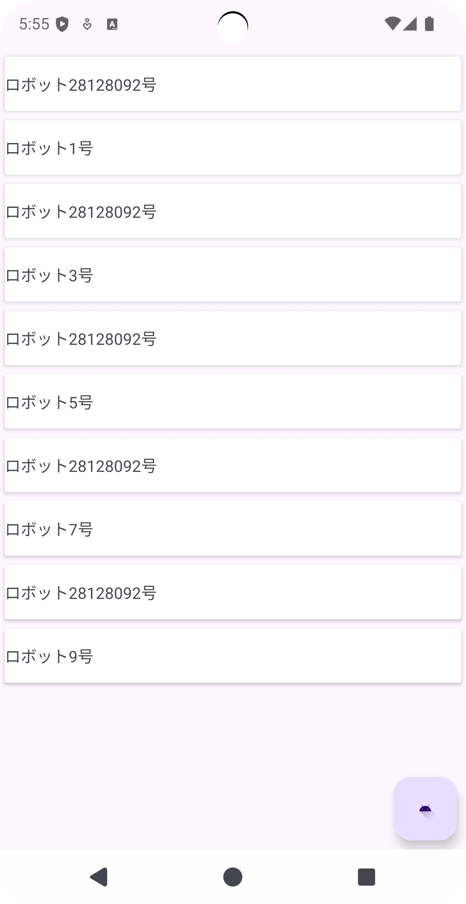
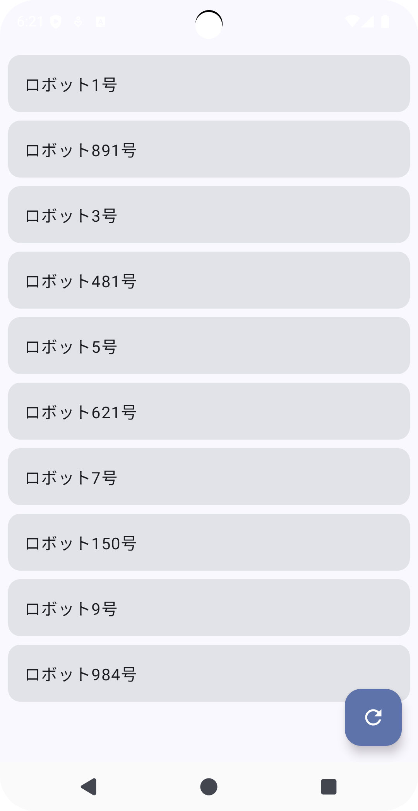

Android StudioのGemini AI Agent　 Mode使ったコーディングサンプル

# Prompt Image & Text



```
[必須機能]
1. リストアイテムクリック時にアイテムの詳細情報を表示する
2. 画面右下のボタンを押すとリストの一部データが更新される
```

# Model
Gemini 2.5 Pro

# capture Pixel Fold API 35 OS 15


